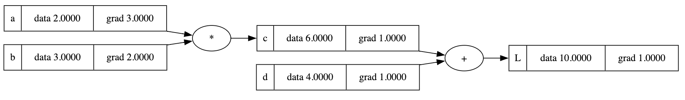

# backgrad

a simple python package for automatic differentiation, inspired by [micrograd](https://github.com/karpathy/micrograd). the main use for this package is to understand the concept of backpropagation and automatic differentiation happening in deep learning frameworks like [PyTorch](https://pytorch.org) and [JAX](https://jax.readthedocs.io)

### Installation

```bash
pip install backgrad
```

### Scalar support

with backgrad you can compute the gradient by executing backpropagation over a defined neural network following the same PyTorch format of [backward](https://pytorch.org/docs/stable/generated/torch.Tensor.backward.html).


### Visualization

this library also supports visualization of the neural network using [graphviz](https://graphviz.org/).



### License

MIT
